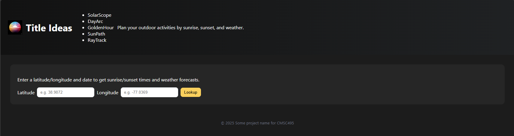

# Goldenhour

### Executive Summary: Brief overview of the project, and its objectives

Many people, such as outdoor enthusiasts and photographers, need accurate information about sunrise and sunset times to plan activities accordingly.  Currently, accessing this information often requires searching multiple apps and can often lead to inaccurate information. The goal of this project is to create a user-friendly sun rise/set time tracker that provides precise daily times for any chosen location. This project will be used by hikers, campers and photographers.

### Project Overview: A detailed description of the project, its scope, and the problem it addresses.

### Project Goals and Objectives: Clearly defined project goals, objectives, and deliverables.

### Project Scope: Define the boundaries and limitations of the project, including what is included and excluded.

### Project Resources: Identify and allocate the necessary resources for the project, including personnel, equipment, and budget.

### Communication Plan: Define the communication channels, frequency, and responsibilities for project updates and collaboration.