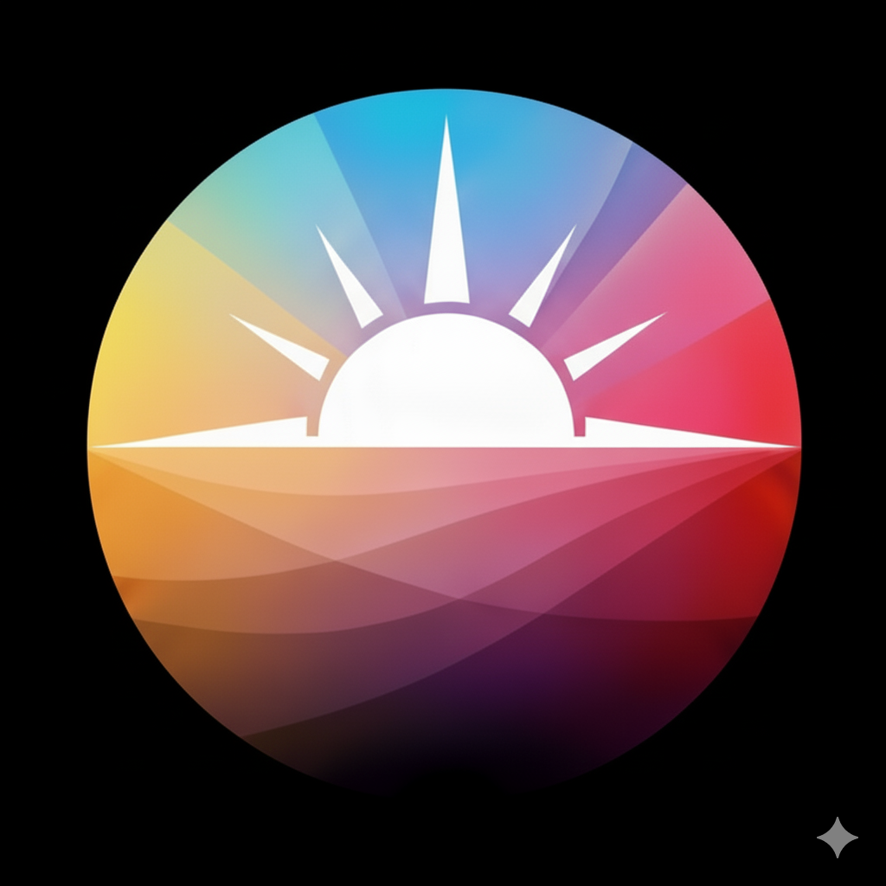
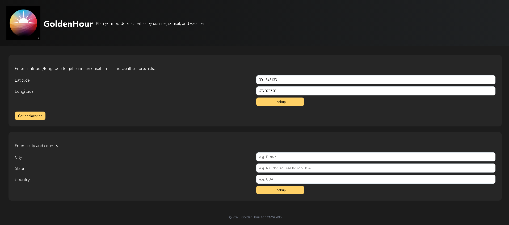
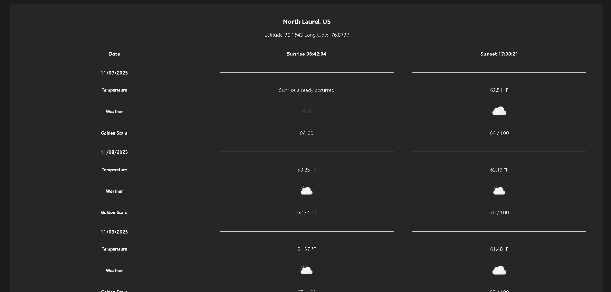
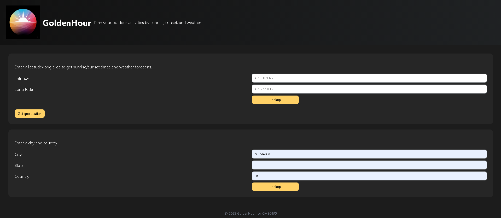
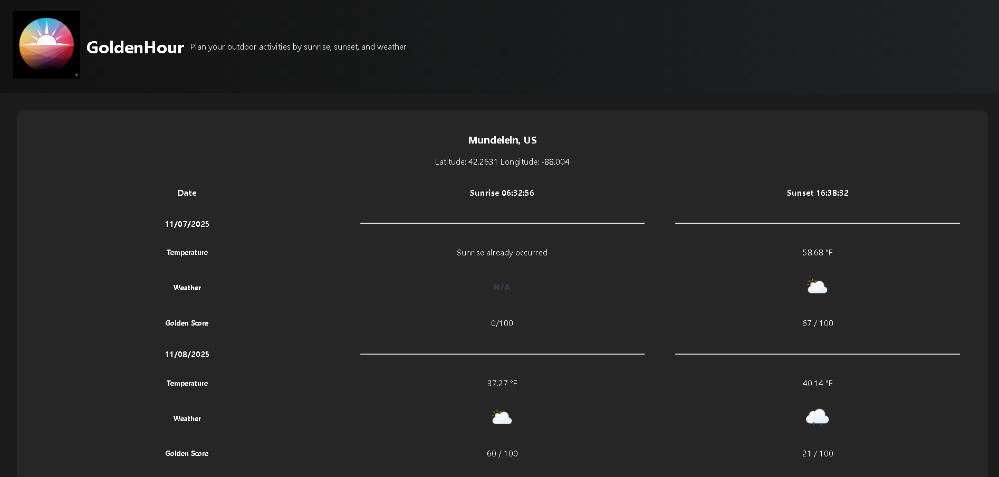
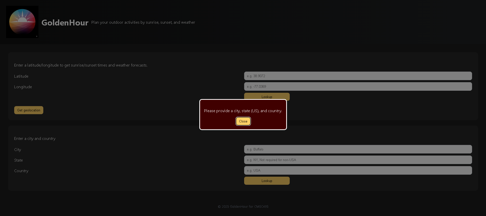

# Goldenhour

Many people, such as outdoor enthusiasts and photographers, need accurate information about sunrise and sunset times to plan activities accordingly.  Currently, accessing this information often requires searching multiple apps and can often lead to inaccurate information. The goal of this project is to create a user-friendly sun rise/set time tracker that provides precise daily times for any chosen location. This project will be used by hikers, campers and photographers.

## Project Setup and Run
See [Flask App](flask_app/README.md)

## Main Features
- Geobased queries
- Location based queries 
- Get Geolocation for the device using browser API's

### Coordinate Based Query

### Location Based Query

### Error State

